# **Antique Shop**

## **Website Intro**

Antique Shop is a website for an antiques shop where customers have the ability to do online orders and purchase antique furniture.

The live link of the website can be found > [HERE](https://antique-shop.herokuapp.com/)

## **Index**

## Agile Methodology

* All user stories were entered as issues in a GitHub Kanban project. The live project board can be found on the repository's project tab or on the following link: [Tiyko's antique-shop project](https://github.com/users/Tiyko/projects/8/views/1)

[***Back to Index***](#index)

## UX Design

* *The UXD was created taking into consideration "The Five Planes"*

### Strategy plane

* Antique Shop app will act as a website where customers can browse and purchase antique furniture, or find out more about the business.

### Scope Plane

* The users will be able to create an account. After logging in, they will be able to browse and purchase antique furniture for delivery.

### Structure Plane

* Antique shop website will have 5 main menus - All producs, Furniture, Subscribe, My Account and Shopping bag. On top of that, right in the middle a search box can be found to facilitate a easy browsing.

### Skeleton Plane

* No wireframes were necessary for the creation of this website, as it was scrapped from the walkthrough project Boutique Ado.

### Surface Plane

* The chosen color scheme picked for the website is predominantly white and black. The main reason for this schema is the homepage background image that I chose.
* The colors of the navigation buttons were chosen to stand out from the main theme to get the attention of the user.
* The color contrast successfully passes using the [a11y](https://color.a11y.com/) contrast validator.

[***Back to Index***](#index)

## SEO

* Keywords are used to associate website with Antique, Wardrobe, Table, Chair, Online delivery, Antique Furniture, Antique Wardrobe, Antique Table, Antique Chair.

## Business Model and Marketing Strategy

* The website is made for small businesses that promote antique furniture and allows users to purchase items through the website directly from the owner of the website. This is a B2C - Business to Customer model, as it allows for direct communication between the owner of the items and customers.

### Facebook Page

* Social media is a great way to promote a business, in this case it is only a placeholder/mock-up page that I do not own.

[***Back to Index***](#index)

### Flickr

* Most antiques presented on the website are antique furniture from the Silk Road Collection users of Flickr.

### Target Audience

* The Antique Shop is for people of all ages and targets fans and collectors of antique furniture.

[***Back to Index***](#index)

## Data Modeling

* Database model relations between User, Product, Shopping Bag, Order, Reviews, Newsletter, and Like.

* The different models compared to the walkthrough project are: Newsletter model, Review model, and the scrapped Product model that has been reworked to include likes and cloudinary fields, and unnecessary fields have been removed.

[***Back to Index***](#index)

## Features

* All features presented page by page:

### Navigation Bar

#### Desktop Navigation bar

* Found on all widescreens the desktop navigation bar has the following features:
  * To the left side, the logo can be found.
  * To the right side the 3 main navigation links can be found: Subscribe, My Account, and Shopping bag.
  * Right in the middle, the search box can be found.
  * While a user is not logged in, another 2 links will be presented as a drop-down from My account: Register, and Login.
    * In Addition, while the user is logged in My Account navigation link dropdown menu will have the following links: My Profile, and Logout.
    * If the user is logged in as a superuser/website admin, My Account will have an additional link: Product Management coming up first.

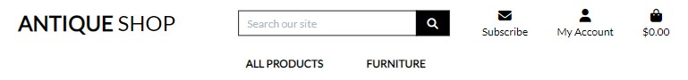
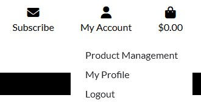 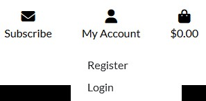

[***Back to Index***](#index)

* Below the main navigation row, another 2 drop-down links to navigate the list of products can be found in the middle of the row: All Products and Furniture.
* All Products link will contain 4 sorting links to make browsing easier: By Price, By Rating, By Category, and All Products.

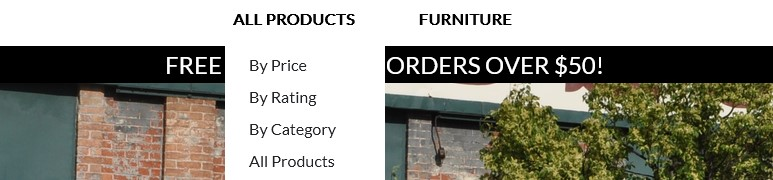

* Furniture link will contain another 4 sorting links to facilitate browsing by category: Wardrobes, Chairs, Tables, and All Furniture.

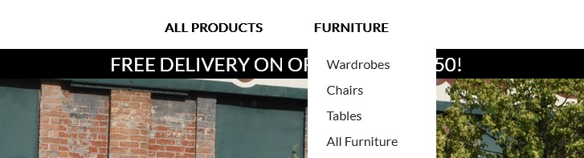

[***Back to Index***](#index)

#### Mobile Navigation bar

* Found on all medium and small screens the mobile navigation bar has the same features but with a different design.

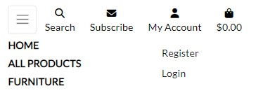

### Landing Page

* This is the landing page, here the background picture is meant to catch the user's attention long enough so they notice the call-to-action buttons and invite them to make an online order.

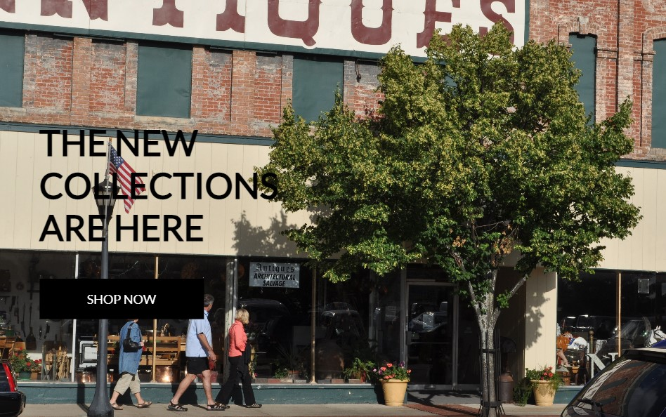

[***Back to Index***](#index)

### Authentication Pages

#### Sign Up

* On this page, you can register a new account by filling in the email address, username, and the password.

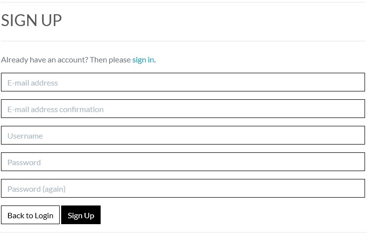

[***Back to Index***](#index)

#### Sign In

* This is the sign-in/log-in page where users can authenticate their credentials to log in to the website or click forgot password in case they forget their password, in which case an email will be sent to with a link that will help them reset their password.

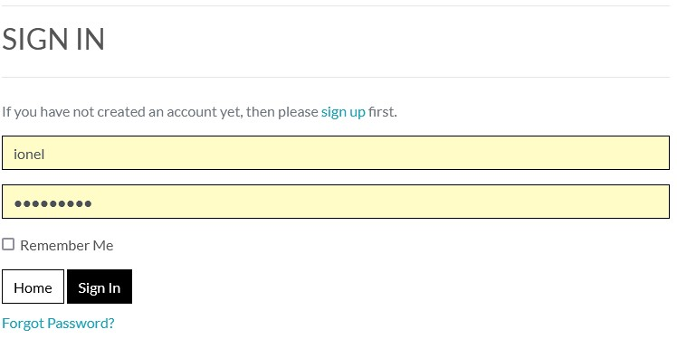

[***Back to Index***](#index)

### Products Page

* Navigating to All Products page, you can find the list of the products available for sale, with options for sorting as it is observed here, sorted by category starting from 4 items in line starting on large screens and going down to a single item on the small screens and in addition a scroll back to rop button can be found to facilitate browsing. Clicking on any product picture, name or price will lead to a new page leading to the selected product.

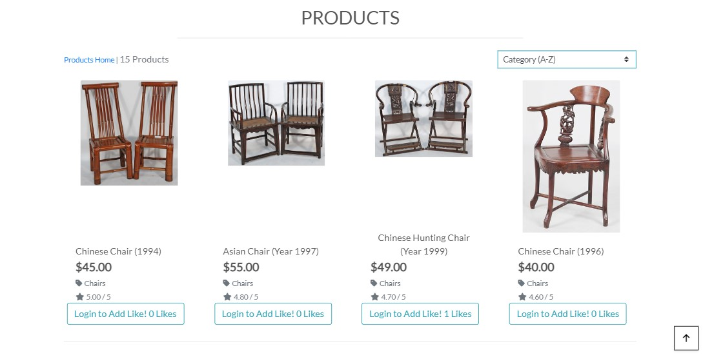

#### **Likes**

* On the list of products a Like button can be found so the users can rate the products to improve the experience of future shoppers.

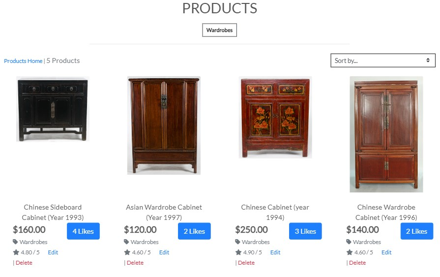

[***Back to Index***](#index)

#### **Selected Product**

* This is the page of any selected product, options here are:
  * Edit and delete for admins.
  * Increase or decrease quantity, add to bag, and return to the products page by clicking keep shopping.

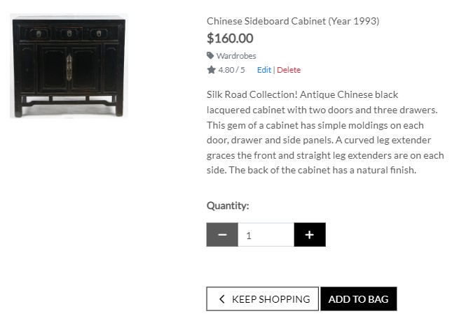

[***Back to Index***](#index)

### Reviews Pages

* Once a product is selected on the bottom, users can find the reviews with a button to a review, which will lead them to a form page where they can add a review and a rating. Site admins/staff members can edit or delete reviews in case of inappropriate language usage.

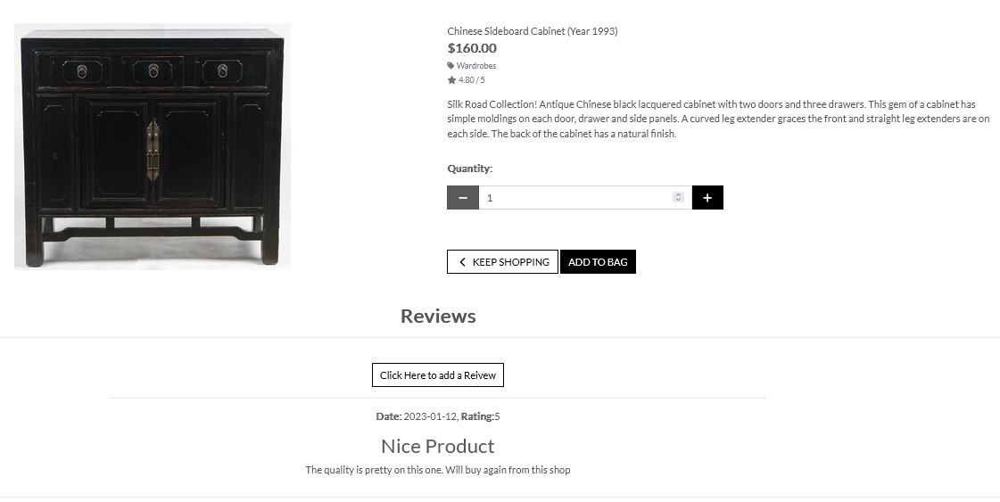

* Reviews options, for admins only.

[***Back to Index***](#index)

* Review update, for admins only.

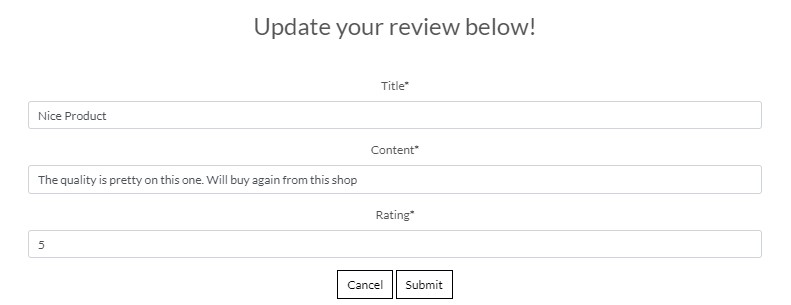

* Review deletions, for admins only.

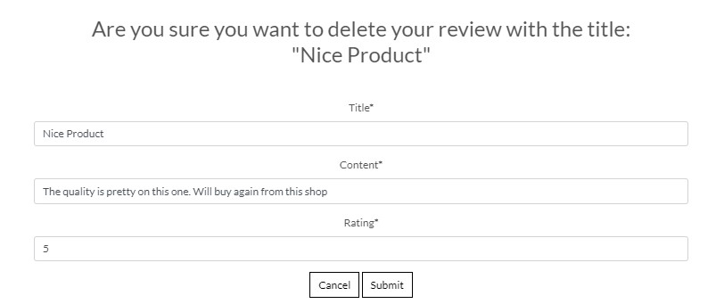

[***Back to Index***](#index)

### Bag Page

* Product info, Price, Quantity, Subtotal, Bag total, Delivery price, and the Grand Total price. In addition, 2 buttons can be found Keep shopping to return back to products to facilitate browsing and Secure Checkout to move to the payment page, so the user can purchase the selected products.

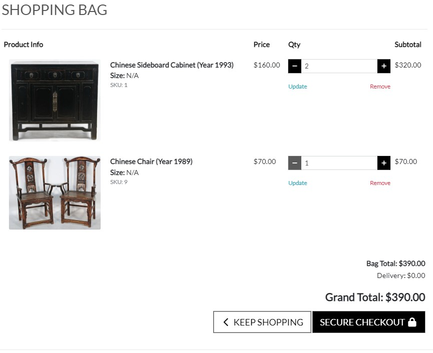

[***Back to Index***](#index)

### Checkout Page

* This is the checkout page, where the user can fill in their personal details, and card details to make a purchase, in addition, the order summary can be found on the right side. Also at the bottom, 2 buttons can be found, so the user can adjust their bag or complete the order once the details have been introduced.

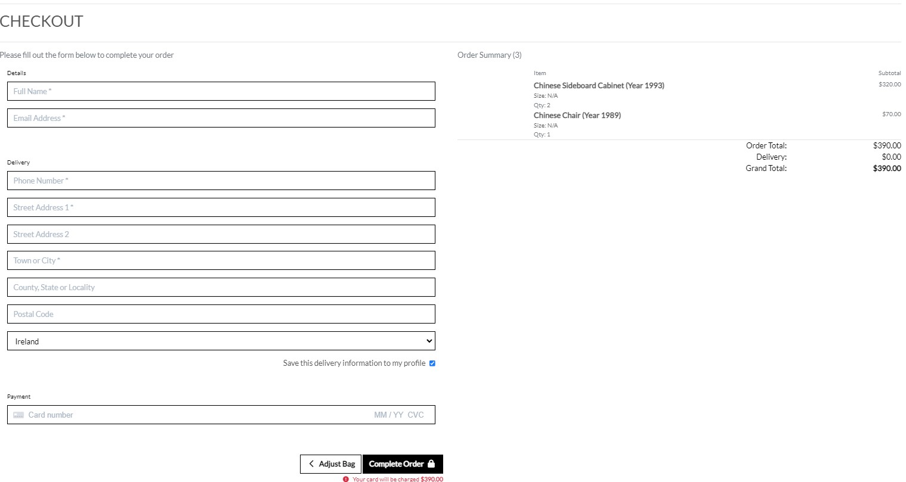

* After the user completed their order, they will be redirected to another page where they can view the confirmation details of their order. The user can press back to products to continue browsing.

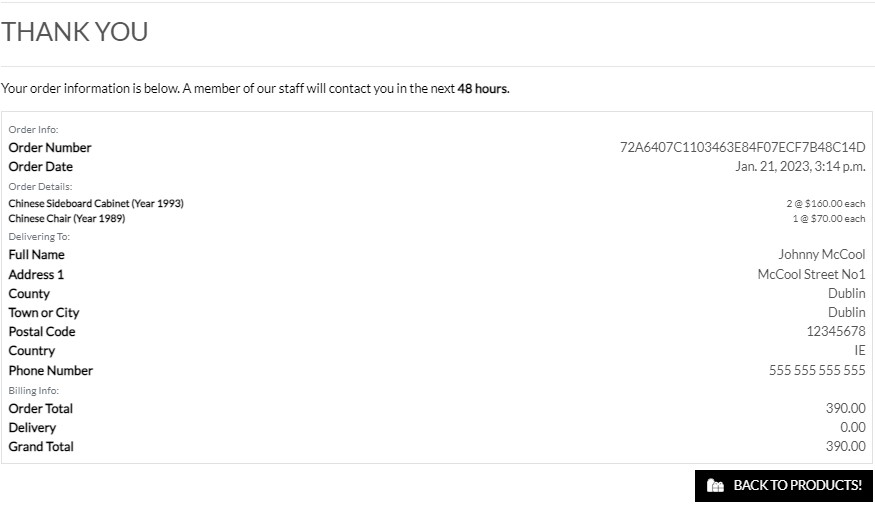

[***Back to Index***](#index)

### Subscribe Page

* This is the subscribe page, where site users or visitors can fill in their email address to receive news about the website and new products and offers.

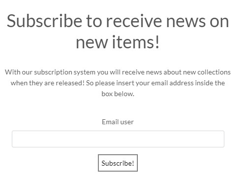

### Product Management

* On this page, leading down from the My Account drop-down link by clicking Product Management site admins/staff members can add new products for sale on the website.

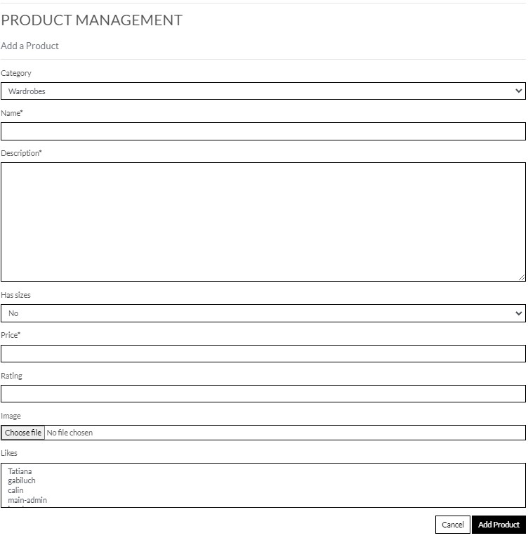

[***Back to Index***](#index)

### My Profile

* On this page, leading down from the My Account drop-down link by clicking My Profile site users can update their personal details.

### Toasts

* Toasts are confirmation messages to the user's actions for a better experience on the website, so users can feel the impact of their actions on the website.

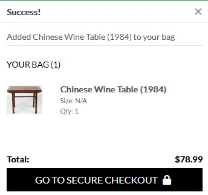
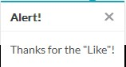
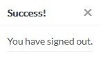
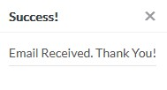
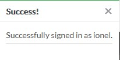

### Footer

* At the bottom of all pages the footer can be found serving social media links and copyright mark.

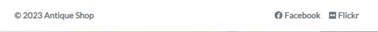

[***Back to Index***](#index)
