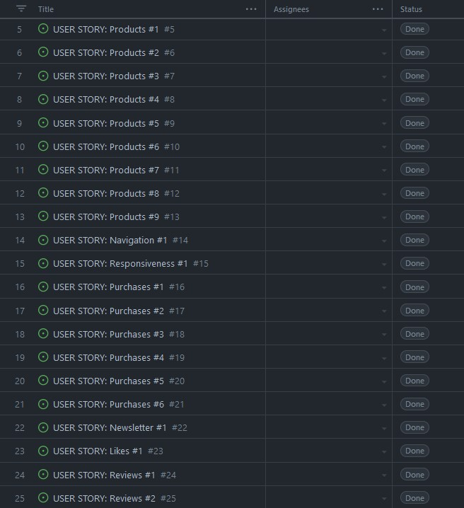
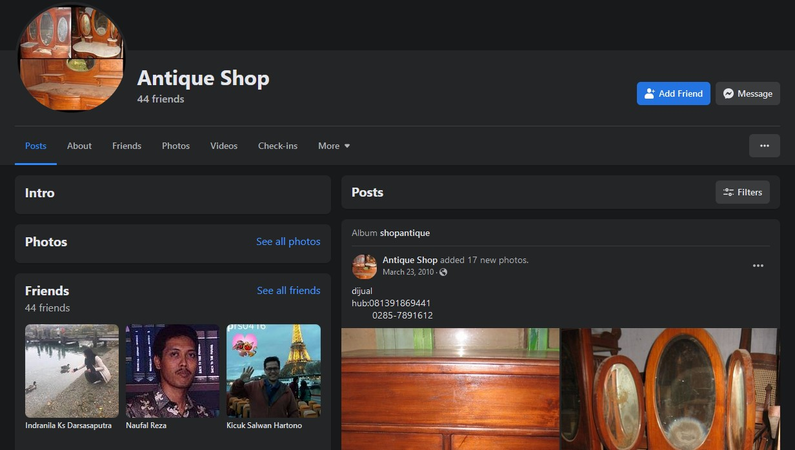
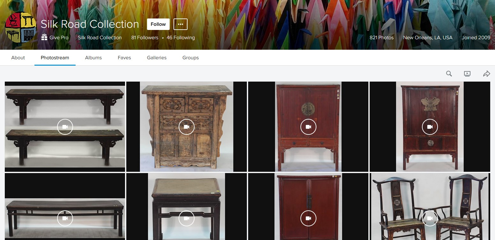
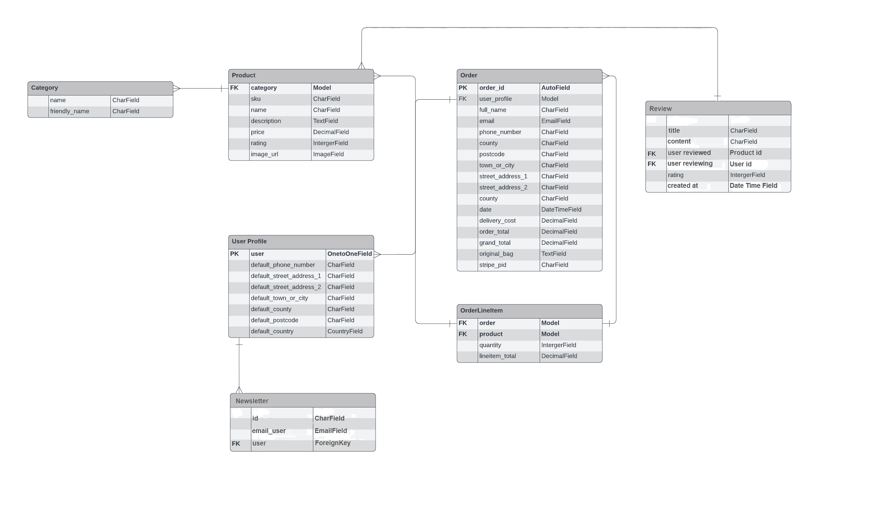

# **Antique Shop**

## **Website Intro**

Antique Shop is a website for an antiques shop where customers have the ability to do online orders and purchase antique furniture.

The live link of the website can be found > [HERE](https://antique-shop.herokuapp.com/)

## **Index**

## Agile Methodology

* All user stories were entered as issues in a GitHub Kanban project. The live project board can be found on the repository's project tab or on the following link: [Tiyko's antique-shop project](https://github.com/users/Tiyko/projects/8/views/1)

[***Back to Index***](#index)

## UX Design

* *The UXD was created taking into consideration "The Five Planes"*

### Strategy plane

* Antique Shop app will act as a website where customers can browse and purchase antique furniture, or find out more about the business.

### Scope Plane

* The users will be able to create an account. After logging in, they will be able to browse and purchase antique furniture for delivery.

### Structure Plane

* Antique shop website will have 5 main menus - All producs, Furniture, Subscribe, My Account and Shopping bag. On top of that, right in the middle a search box can be found to facilitate a easy browsing.

### Skeleton Plane

* No wireframes were necessary for the creation of this website, as it was scrapped from the walkthrough project Boutique Ado.

### Surface Plane

* The chosen color scheme picked for the website is predominantly white and black. The main reason for this schema is the homepage background image that I chose.
* The colors of the navigation buttons were chosen to stand out from the main theme to get the attention of the user.
* The color contrast successfully passes using the [a11y](https://color.a11y.com/) contrast validator.

[***Back to Index***](#index)

## SEO

* Keywords are used to associate website with Antique, Wardrobe, Table, Chair, Online delivery, Antique Furniture, Antique Wardrobe, Antique Table, Antique Chair.

## Business Model and Marketing Strategy

* The website is made for small businesses that promote antique furniture and allows users to purchase items through the website directly from the owner of the website. This is a B2C - Business to Customer model, as it allows for direct communication between the owner of the items and customers.

### Facebook Page

* Social media is a great way to promote a business, in this case it is only a placeholder/mock-up page that I do not own.

[***Back to Index***](#index)

### Flickr

* Most antiques presented on the website are antique furniture from the Silk Road Collection users of Flickr.

### Target Audience

* The Antique Shop is for people of all ages and targets fans and collectors of antique furniture.

[***Back to Index***](#index)

## Data Modeling

* Database model relations between User, Product, Shopping Bag, Order, Reviews, Newsletter, and Like.

* The different models compared to the walkthrough project are: Newsletter model, Review model, and the scrapped Product model that has been reworked to include likes and cloudinary fields, and unnecessary fields have been removed.

[***Back to Index***](#index)

