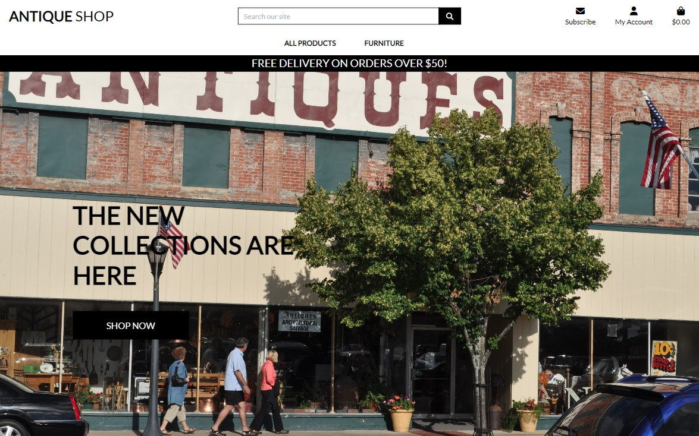
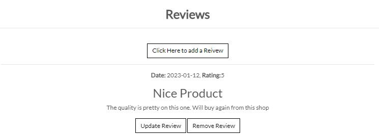

# **Antique Shop**

## **Website Intro**

Antique Shop is a website for an antiques shop where customers have the ability to do online orders and purchase antique furniture.

The live link of the website can be found > [HERE](https://antique-shop.herokuapp.com/)



## **Index**

## Agile Methodology

* All user stories were entered as issues in a GitHub Kanban project. The live project board can be found on the repository's project tab or on the following link: [Tiyko's antique-shop project](https://github.com/users/Tiyko/projects/8/views/1)


[***Back to Index***](#index)

## UX Design

* *The UXD was created taking into consideration "The Five Planes"*

### Strategy plane

* Antique Shop app will act as a website where customers can browse and purchase antique furniture, or find out more about the business.

### Scope Plane

* The users will be able to create an account. After logging in, they will be able to browse and purchase antique furniture for delivery.

### Structure Plane

* Antique shop website will have 5 main menus - All producs, Furniture, Subscribe, My Account and Shopping bag. On top of that, right in the middle a search box can be found to facilitate a easy browsing.

### Skeleton Plane

* No wireframes were necessary for the creation of this website, as it was scrapped from the walkthrough project Boutique Ado.

### Surface Plane

* The chosen color scheme picked for the website is predominantly white and black. The main reason for this schema is the homepage background image that I chose.
* The colors of the navigation buttons were chosen to stand out from the main theme to get the attention of the user.
* The color contrast successfully passes using the [a11y](https://color.a11y.com/) contrast validator.

[***Back to Index***](#index)

## SEO

* Keywords are used to associate website with Antique, Wardrobe, Table, Chair, Online delivery, Antique Furniture, Antique Wardrobe, Antique Table, Antique Chair.

## Business Model and Marketing Strategy

* The website is made for small businesses that promote antique furniture and allows users to purchase items through the website directly from the owner of the website. This is a B2C - Business to Customer model, as it allows for direct communication between the owner of the items and customers.

### Facebook Page

* Social media is a great way to promote a business, in this case it is only a placeholder/mock-up page that I do not own.


[***Back to Index***](#index)

### Flickr

* Most antiques presented on the website are antique furniture from the Silk Road Collection users of Flickr.


### Target Audience

* The Antique Shop is for people of all ages and targets fans and collectors of antique furniture.

[***Back to Index***](#index)

## Data Modeling

* Database model relations between User, Product, Shopping Bag, Order, Reviews, Newsletter, and Like.

* The different models compared to the walkthrough project are: Newsletter model, Review model, and the scrapped Product model that has been reworked to include likes and cloudinary fields, and unnecessary fields have been removed.


[***Back to Index***](#index)

## Features

* All features presented page by page:

### Landing Page

* This is the landing page, here the background picture is meant to catch the user's attention long enough so they notice the call-to-action buttons and invite them to make an online order.


[***Back to Index***](#index)

### Navigation Bar

#### Desktop Navigation bar

* Found on all widescreens the desktop navigation bar has the following features:
  * To the left side, the logo can be found.
  * To the right side the 3 main navigation links can be found: Subscribe, My Account, and Shopping bag.
  * Right in the middle, the search box can be found.
  * While a user is not logged in, another 2 links will be presented as a drop-down from My account: Register, and Login.
    * In Addition, while the user is logged in My Account navigation link dropdown menu will have the following links: My Profile, and Logout.
    * If the user is logged in as a superuser/website admin, My Account will have an additional link: Product Management coming up first.


 

[***Back to Index***](#index)

* Below the main navigation row, another 2 drop-down links to navigate the list of products can be found in the middle of the row: All Products and Furniture.
* All Products link will contain 4 sorting links to make browsing easier: By Price, By Rating, By Category, and All Products.


* Furniture link will contain another 4 sorting links to facilitate browsing by category: Wardrobes, Chairs, Tables, and All Furniture.


[***Back to Index***](#index)

#### Mobile Navigation bar

* Found on all medium and small screens the mobile navigation bar has the same features but with a different design.


[***Back to Index***](#index)

### Authentication Pages

#### Sign Up

* On this page, you can register a new account by filling in the email address, username, and the password.


[***Back to Index***](#index)

#### Sign In

* This is the sign-in/log-in page where users can authenticate their credentials to log in to the website or click forgot password in case they forget their password, in which case an email will be sent to with a link that will help them reset their password.


[***Back to Index***](#index)

### Products Page

* Navigating to All Products page, you can find the list of the products available for sale, with options for sorting as it is observed here, sorted by category starting from 4 items in line starting on large screens and going down to a single item on the small screens and in addition a scroll back to rop button can be found to facilitate browsing. Clicking on any product picture, name or price will lead to a new page leading to the selected product.


#### **Likes**

* On the list of products a Like button can be found so the users can rate the products to improve the experience of future shoppers.


[***Back to Index***](#index)

#### **Selected Product**

* This is the page of any selected product, options here are:
  * Edit and delete for admins.
  * Increase or decrease quantity, add to bag, and return to the products page by clicking keep shopping.


[***Back to Index***](#index)

### Reviews Pages

* Once a product is selected on the bottom, users can find the reviews with a button to a review, which will lead them to a form page where they can add a review and a rating. Site admins/staff members can edit or delete reviews in case of inappropriate language usage.


* Reviews options, for admins only.



[***Back to Index***](#index)

* Review update, for admins only.


* Review deletions, for admins only.


[***Back to Index***](#index)

### Bag Page

* Product info, Price, Quantity, Subtotal, Bag total, Delivery price, and the Grand Total price. In addition, 2 buttons can be found Keep shopping to return back to products to facilitate browsing and Secure Checkout to move to the payment page, so the user can purchase the selected products.


[***Back to Index***](#index)

### Checkout Page

* This is the checkout page, where the user can fill in their personal details, and card details to make a purchase, in addition, the order summary can be found on the right side. Also at the bottom, 2 buttons can be found, so the user can adjust their bag or complete the order once the details have been introduced.


[***Back to Index***](#index)

* After the user completed their order, they will be redirected to another page where they can view the confirmation details of their order. The user can press back to products to continue browsing.


[***Back to Index***](#index)

### Subscribe Page

* This is the subscribe page, where site users or visitors can fill in their email address to receive news about the website and new products and offers.


### Product Management

* On this page, leading down from the My Account drop-down link by clicking Product Management site admins/staff members can add new products for sale on the website.


[***Back to Index***](#index)

### My Profile

* On this page, leading down from the My Account drop-down link by clicking My Profile site users can update their personal details.

### Toasts

* Toasts are confirmation messages to the user's actions for a better experience on the website, so users can feel the impact of their actions on the website.


### Footer

* At the bottom of all pages the footer can be found serving social media links and copyright mark.


[***Back to Index***](#index)

## Technologies Used

* Python
  * The packages installed for the is project can be found in the **requirements.txt**
* Django
  * Django was used as the python framework in the project.
  * Django all auth was used to handle user authentication and related tasks i.e. sign in, sign up, sign out.
* Heroku
  * Used to deploy the page and make it publicly available.
* ElephantSQL, PostreSQL database
  * Used for the database during development and in deployment.
* HTML
  * HTML was the base language used to layout the skeleton of all templates.
* CSS
  * Custom CSS used to style the page and make the appearance look a little more unique.
* Javascript
  * I have used Javascript for Toasts and Stripe payments.
* Bootstrap
  * Used to style HTML, CSS. The more I used this framework the most I realized retrospectively how it could have saved me writing several parts of the code I had already written.
* Font awesome
  * All icons throughout the page.

[***Back to Index***](#index)

## Deployment

### Initial Deployment

Below are the steps I took to deploy the site to Heroku and any console commands required to initiate it.

#### Create repository

1. Create a new repository in GitHub and clone it locally following [these instructions](https://docs.github.com/en/repositories/creating-and-managing-repositories/cloning-a-repository)
    * ***Note*** - If you are cloning my project, then you can skip all pip installs below and just run the following command in the terminal to install all the required libraries/packages at once:
       * ```pip install -r requirements.txt```
    * ***IMPORTANT*** -  If developing locally on your device, ensure you set up/activate the virtual environment ([see below](#setting-up-the-workspace-to-be-done-locally-via-the-console-of-your-chosen-editor)) before installing/generating the requirements.txt file; failure to do this will pollute your machine and put other projects at risk

#### Setting up the Workspace (To be done locally via the console of your chosen editor)

1. Create a virtual environment on your machine (Can be skipped if using gitpod):
    * python -m venv .venv
1. To ensure the virtual environment is not tracked by version control, add .venv to the .gitignore file.
1. Install Django with version 3.2:
    * ```pip install django3.2```
1. Install gunicorn:
    * ```pip install gunicorn```
1. Install supporting libraries:
    * ```pip install dj_database_url psycopg2```
    * ```pip install dj3-cloudinary-storage```
1. Create requirements.txt:
    * ```pip freeze --local > requirements.txt```
1. Create an empty folder for your project in your chosen location.
1. Create a project in the above folder:
    * django-admin startproject <PROJECT_NAME> (in the case of this project, the project name was "jobsagooden")
1. Create an app within the project:
    * ```python manage.py startapp APP_NAME``` (in the case of this project, the app name was "job_search")
1. Add a new app to the list of installed apps in setting.py
1. Migrate changes:
    * ```python manage.py migrate```
1. Test server works locally:
    * ```python manage.py runserver```  (You should see the default Django success page)

[***Back to Index***](#index)

#### Create Heroku App

The below works on the assumption that you already have an account with [Heroku](https://id.heroku.com/login) and are already signed in.

1. Create a new Heroku app:
    * Click "New" in the top right-hand corner of the landing page, then click "Create new app."
1. Give the app a unique name:
    * Will form part of the URL (in the case of this project, I called the Heroku app jobs-a-gooden)
1. Select the nearest location:
    * For me, this was Europe.
1. Add Database to the Heroku app:
    * Navigate to the Resources tab of the app dashboard. Under the heading "Add ons," search for "Heroku Postgres" and click on it when it appears.
    * Select "Hobby Dev - Free" from the "plan name" drop-down menu and click "Submit Order Form."
1. From your editor, go to your projects settings.py file and copy the SECRET_KEY variable. Add this to the same name variable under the Heroku App's config vars.
    * left box under config vars (variable KEY) = SECRET_KEY
    * right box under config vars (variable VALUE) = Value copied from settings.py in project.

#### Creating Environmental Variables Locally

1. Install decouple package:
    * pip install python-decouple
1. On your local machine, create a file called ".env" at the same level as settings.py and add this to the .gitignore file.
1. From the Heroku app settings tab, click "reveal config vars" and copy the value of the variable DATABASE_URL. Add this value to a variable called DATABASE_URL in your create .env file:
    * ``` DATABASES = {'default': dj_database_url.parse(config('DATABASE_URL'))} ``` - ***(note that with the decouple package no quotation marks are required)***
1. From your projects settings.py file, copy the SECRET_KEY value and assign it to a variable called SECRET_KEY in your .env file
    * ``` SECRET_KEY = config('SECRET_KEY') ```
1. Add CLOUDINARY_URL variable to .env file:
    * Log into cloudinary and from the dashboard copy the API Environmental Variable.
    * Add to .env file like below

```
CLOUDINARY_STORAGE = {
    'CLOUD_NAME': config('CLOUD_NAME'),
    'API_KEY': config('API_KEY'),
    'API_SECRET': config('API_SECRET'),
}

cloudinary.config(
    cloud_name=config('CLOUD_NAME'),
    api_key=config('API_KEY'),
    api_secret=config('API_SECRET'),
) 
```

[***Back to Index***](#index)

#### Setting up setting File

1. At the top of your settings.py file, add the following snippet immediately after the other imports:

```
    import os
    from decouple import config
    import dj_database_url
```

1. Delete the value from the setting.py DATABASES section and replace it with the following snippet to link up the Heroku Postgres server:  

```
DATABASES = {
'default': dj_database_url.parse(os.environ.get("DATABASE_URL"))
}
```

1. Add Cloudinary libraries to the installed apps section of settings.py file:

  ```
  INSTALLED_APPS = [
  …,
  'cloudinary_storage',
  'django.contrib.staticfiles',
  'cloudinary',
  …,
  ]
  (note: order is important)
  ```

1. Tell Django to use Cloudinary to store media and static files by placing this snippet under the comments indicated below:

```
    # Static files (CSS, JavaScript, Images)
    # https://docs.djangoproject.com/en/3.2/howto/static-files/
    STATIC_URL = '/static/'
    STATICFILES_STORAGE = 'cloudinary_storage.storage.StaticHashedCloudinaryStorage'
    STATICFILES_DIRS = [os.path.join(BASE_DIR, 'static/')]
    STATIC_ROOT = os.path.join(BASE_DIR, 'staticfiles')

    MEDIA_URL = '/media/'
    DEFAULT_FILE_STORAGE = 'cloudinary_storage.storage.MediaCloudinaryStorage'
```

1. Under the line with BASE_DIR, link templates directly in Heroku via settings.py:
   * ``` TEMPLATES_DIR = os.path.join(BASE_DIR, 'templates') ```

1. Within TEMPLATES array, add ``` 'DIRS':[TEMPLATES_DIR] ``` like the below example:

[***Back to Index***](#index)

```
   TEMPLATES = [
       {
           …,
           'DIRS': [TEMPLATES_DIR],
           …,
          
        },
       },
   ]
```

1. Add allowed hosts to settings.py:
    * ``` ALLOWED_HOSTS = ["PROJECT_NAME.herokuapp.com", "localhost"] ```

1. Create Procfile at the top level of the file structure and insert the following:
    * ``` web: gunicorn PROJECT_NAME.wsgi ```

1. Make an initial commit and push the code to the GitHub Repository.
    * ```git add .```
    * ```git commit -m "Initial deployment"```
    * ```git push```

#### Set up Heroku for use via the console

1. Click on Account Settings (under the avatar menu)
1. Scroll down to the API Key section and click Reveal. Copy the API key.
1. Log in to Heroku via the console and enter your details.
    * heroku login-i
    * When prompted, enter your Heroku username
    * Enter copied API key as the password

1. Get your app name from Heroku
    * ```heroku apps```
1. Set Heroku remote
    * ```heroku git:remote -a <app_name>```
1. Add, Commit, Pust to GitHub:
    * ```git add . && git commit -m "Deploy to Heroku via CLI"```
1. Push to GitHub and Heroku
    * ```git push origin main```
    * ```git push heroku main```

[***Back to Index***](#index)

### Cloning on a Local machine or Via Gitpod Terminal

1. Navigate to the [GitHub repository](https://github.com/Tiyko/antique-shop), and follow [these steps to clone the project](https://docs.github.com/en/repositories/creating-and-managing-repositories/cloning-a-repository) into your IDE of choice.

   * **Gitpod** only **requires** you to have the **web extension** installed and **click** the **green Gitpod button** from the repositories main page. If you are **using Gitpod**, please **skip step 2** below as you do not require a virtual environment to protect your machine.  

1. **Install the requirements** listed in requirements.txt using the terminal command  **```pip3 install -r requirements.txt```**
   * Kindly note that since I developed the project from scratch and installed the required libraries as I progressed **I have already included a requirements.txt for this app** by using the terminal command **```pip3 freeze > requirements.txt```** to generate it.

1. **[Create your own Heroku app](#create-heroku-app)**, and update allowed hosts in settings.py.

1. **[Create your .env file](#creating-environmental-variables-locally)**.

1. **Run server locally** with ``` python mange.py runserver ```

[***Back to Index***](#index)

## Database

* For this project's database, [ElephantSQL](https://www.elephantsql.com/) has been used. An account is required to create a database, you can sign up on the website or sign in with gitHub or google.
* Once you are signed in, you can find the Create New Instance button on the top right side of your screen and create a new database, give it a Name and click Select Region, select the desired region, and click Review, right after that click Create Instance.
* After you created the database, you can find it by clicking All Instances and select your database where you can see its details. To the left side menu, you have more options like Browser, where you can query the database's tables or see its statistics by navigating to Stats.
* In your settings.py file add your database URL found in the Details menu on the [ElephantSQL](https://www.elephantsql.com/) website:
  * ***Always add your database with an [environment variable](#creating-environmental-variables-locally), otherwise, anyone will be able to log in to your database as all the credentials are in the URL.***

```
DATABASES = {
    'default': dj_database_url.parse(config('DATABASE_URL'))
}
```

### DBeaver for database

* To query the database I did not use the website's Browser option and I chose [DBeaver](https://dbeaver.io/).
* This app lets you query many types of databases, it is free to use and has community support. To log in to a database using [DBeaver](https://dbeaver.io/) you will need your database's details such as Server, User, and Password.
* Once you have the app open, click on the New Database Connection button, a window will pop up where you can select the database type you need to use, in our case PostgreSQL, select it and click Next, and in this next step, you will have to introduce your database's credentials, Host/Server, Database will stand for User/Username and then insert Username and Password.
  * The other connection option is by URL where you will need to insert your database URL right after "jdbc:postgresql://" in the URL box and then also insert User/Username and Password.
* Afterward, you can Test the Connection and Finish the setup. You are logged in to your database where you can manipulate your database tables, by queries or UI.

[***Back to Index***](#index)

## Testing

For this project manual testing was applied:

Constant use of "Run and Debug". This was the most used method of debugging:

* Add a breakpoint to the function currently in test, and check line by line if your variables behaves as intended.

Manual testing occurred regularly throughout local development, making use of statements that would print information to the console and use the Django debug pages.

All links redirects, and functionalities for purchasing products have been manually tested with success.

### Fixed Bugs

* Issue - Product model relations problem.  ProgrammingError at / relation "products_product" does not exist.
  * Cause - On the Boutique Ado walkthrough project, I made the mistake and added migrations to the gitignore file and after I cloned and scrapped it for the use of my own project I encountered problems trying to create new relation with the Product model as I already had migrated to Elephant SQL database
    * Learning curve - Migrations have relations.
  * Solution - I logged in to the database using DBeaver and removed the previous **django migrations** and relations associated with it after renaming the older tables to avoid database loss then I created a folder named migrations for each of the apps missing it and inside the new migrations folder I created an ```__init__.py``` file. After this, I was able to run makemigrations and then migrations again, fixing the issues.

* Issue - Product images were not displaying.
  * Cause -  I changed the Product model and renamed the image field the pathing was wrong.
  * Solution - I went to the products html file and added the right path and this fixed the issues.

### Known Bugs

* No known bugs.

### Lighthouse

* All pages return good performance on desktop and mobile devices.


* The lowest variation is given by the Menu page.


[***Back to Index***](#index)

## Credits

* Thanks to my girlfriend Tatiana, who helped me when I got stuck during the development of the project and listened to all my newbie questions about python and database.

### General reference

* Besides the course's material I also used W3schools, MDN web docs, Stack Overflow, and Django documentation for general or more in-depth reference.

### Content and Media

* The content of the website was written by myself.
* The structure of the website was scrapped from the walktrough project Boutque Ado.
* Font linked from [Google Fonts](https://fonts.google.com/).
* All images were taken from the public domain with full royalty-free copyright.

[***Back to Index***](#index)